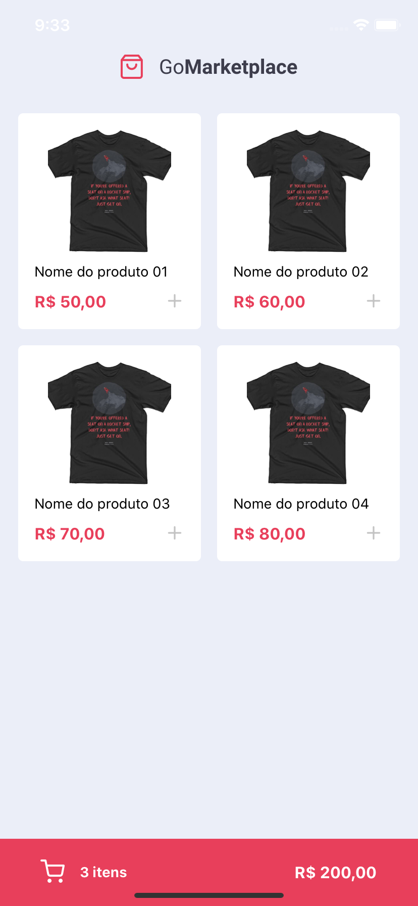
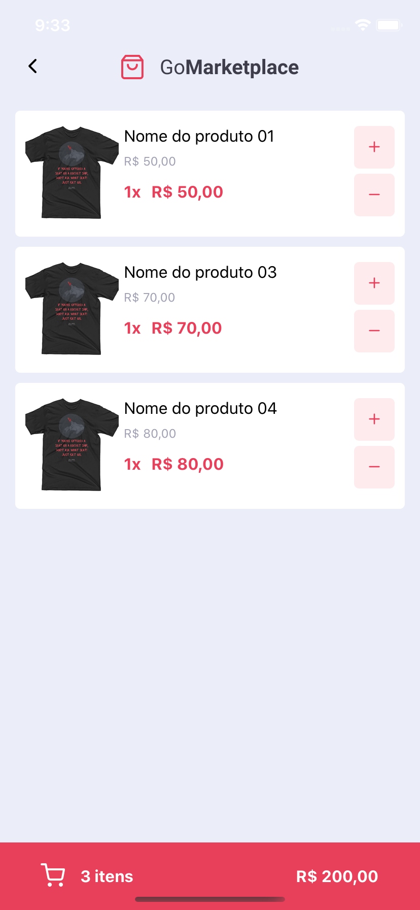

<h3 align="center">
  Desafio 08: Fundamentos do React Native
</h3>

<blockquote align="center">“Não existe linha de chegada, a vitória está em se manter correndo”!</blockquote>

<p align="center">
  

  <a href="https://valdirmendes.dev">
    
  </a>

  

  <a href="https://github.com/valdirmendesdev/gostack-fundamentos-react-native/stargazers">
    
  </a>
</p>

<p align="center">
  <a href="#rocket-sobre-o-desafio">Sobre o desafio</a>&nbsp;&nbsp;&nbsp;|&nbsp;&nbsp;&nbsp;
  <a href="#memo-licença">Licença</a>
</p>

## :rocket: Sobre o desafio

Nesse desafio, foi proposto desenvolver a aplicação mobile de uma loja virtual, a GoMarketplace.

Nesse projeto o intuito é praticar o React Native com TypeScript, utilizando rotas, Async Storage e a Context API.


### :lock: Dependências da aplicação

O foco do projeto é o desenvolvimento da aplicação mobile então não foi construída uma API real para prover informações para esse projeto.

Contudo, para que tivéssemos dados para exibir em tela, foi disponibilizado um arquivo json que servirá como uma fake API para prover os dados.

Para isso, foi instalado no package.json uma dependência chamada `json-server`, e um arquivo chamado `server.json` que contém os dados para uma rota `/products`.

Para que aplicação rode no simulador e você tenha a experiência completa da aplicação, execute esse servidor antes da iniciar a aplicação com o seguinte comando:

```js
  yarn json-server server.json -p 3333
```

### Layout da aplicação

<p align="center">
  
  
</P>

### Funcionalidades da aplicação

Segue lista de funcionalidades implementadas nessa aplicação.

- **`Listar os produtos`**: Na página inicial exibe uma listagem de produtos em forma de uma tabela. Cada item exibe `titulo`, `imagem` e `preço` de um produto.

- **`Adicionar itens ao carrinho`**: É possível clicar no ícone `+` para adicionar um produto ou adicionar mais uma unidade daquele produto ao carrinho.

- **`Exibir itens do carrinho`**: Na página do carrinho é exibido todos os itens do carrinho, junto com a quantidade, valor único, valor subtotal dos itens e total de todos os items.

- **`Aumentar quantidade de itens do carrinho`**: Na página do carinho é possível que o usuário aumente a quantidade de itens do mesmo produto.

- **`Diminuir quantidade de um item do carrinho`**: Na página do carinho é que o usuário decremente a quantidade de itens do mesmo produto.

- **`Exibir valor total dos itens no carrinho`**: Tanto na página inicial quanto na página do carrinho é exibido o valor total de todos os itens que estão no seu carrinho. Na página inicial, ao clicar no ícone do carinho, o usuário será direcionado para a página do carrinho.

### :running: Rodando a aplicação

Para executar a aplicação, clone este repositório, entre na pasta do projeto e instale as dependências com o seguinte comando no terminal:

```bash
yarn
```

**Atenção**: Caso você esteja emulando no iOS, na pasta do projeto navegue até a pasta ios executando o comando `cd ios` e depois execute `pod install` para linkar todas as dependências para o iOS.

#### :running: Rodando no emulador do iOS

Para rodar a aplicação no emulador do iOS, execute o seguinte comando no terminal:

```bash
yarn ios
```

ou

```bash
npx react-native run-ios
```

#### :running: Rodando no emulador android

Para rodar a aplicação no emulador do Android, execute o seguinte comando no terminal:

```bash
yarn android
```

ou

```bash
npx react-native run-android
```

#### :running: Rodando os testes automatizados

Para rodar os testes automatizados, execute o seguinte comando no terminal:

```bash
yarn test
```

## :memo: Licença

Esse projeto está sob a licença MIT. Veja o arquivo [LICENSE](LICENSE) para mais detalhes.
